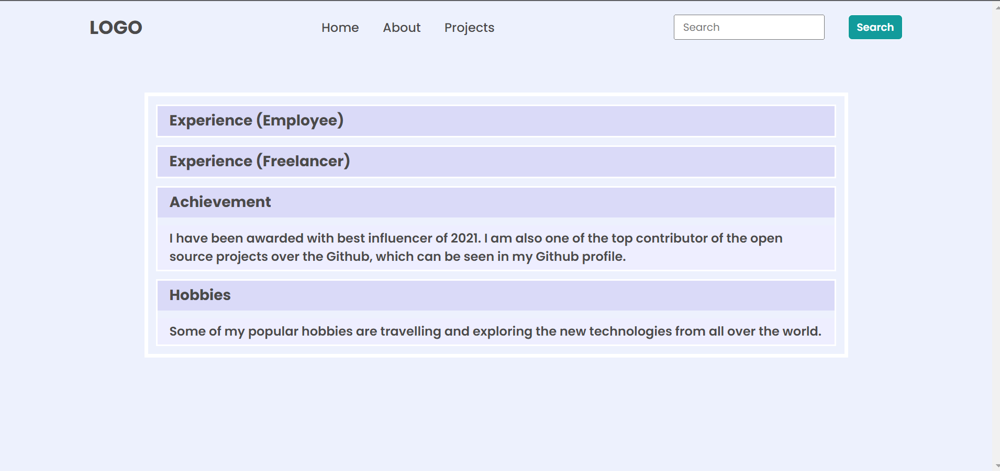

#### Project-02

#### Question1



```javascript

var ul = document.querySelector("ul");
ul.children[2].innerHTML = "Project";

const accordianHeading = document.querySelectorAll(".accordian h3");
accordianHeading.forEach(element => {
  element.style.backgroundColor ="#dadaf8";
});

const accordianParagraph = document.querySelectorAll(".accordian p");
accordianParagraph.forEach(element => {
  element.style.backgroundColor ="#eeeeff";
});

```

#### Question2


```javascript

const faqSection = document.querySelector(".accordian-wrapper");

const skills = document.createElement("div");
faqSection.appendChild(skills);
skills.classList.add("accordian");

const skillsTitle = document.createElement("h3");
skills.appendChild(skillsTitle);
skillsTitle.innerHTML = "Skills";

const skillsParagraph = document.createElement("p");
skills.appendChild(skillsParagraph);
skillsParagraph.innerHTML = "I posses a very good command over the full stack Development technology like MERN which can be seen in my work over the Github."

```
